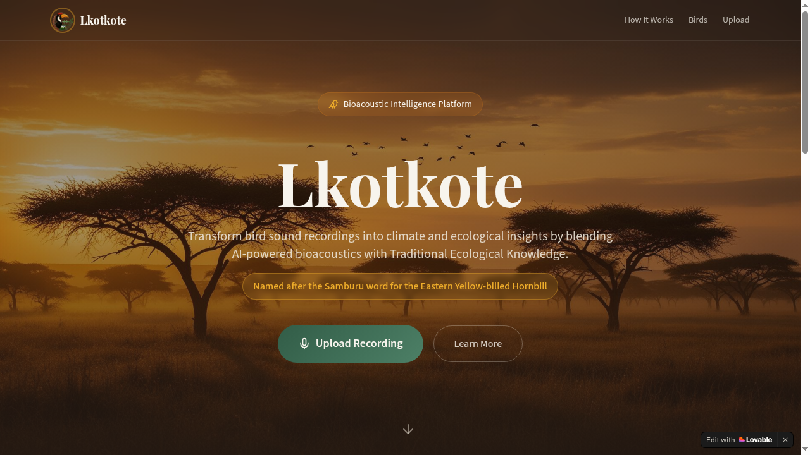
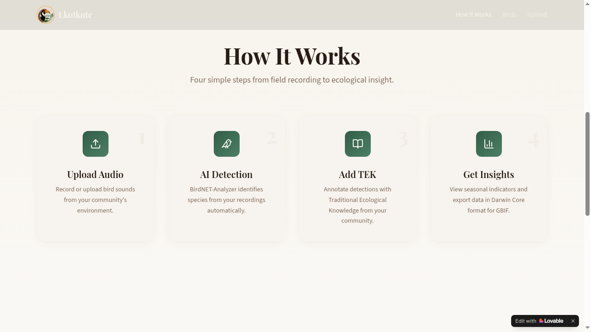
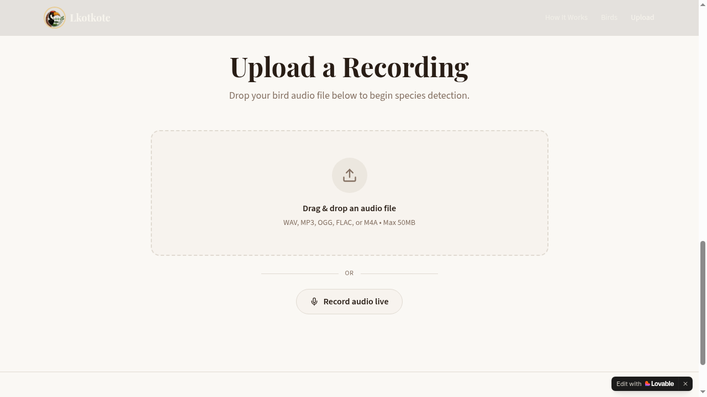

<div align="center">


# Lkotkote — Sound Wisdom

### *Bird sound identification powered by BirdNET, named after the Samburu word for the Eastern Yellow-billed Hornbill.*

[](https://lkotkote.org)
[](https://vercel.com)


<br />



</div>

---

Lkotkote platform represents a new class of tools that bridge Indigenous knowledge systems with global biodiversity infrastructures.

Lkotkote turns bird audio into ecological insight. Record or upload a clip, run it through the **BirdNET** acoustic model, plot detections on a timeline and map, capture **Traditional Ecological Knowledge (TEK)** annotations, and export in **Darwin Core** format for biodiversity research.

> 🔗 **Try it now:** **https://lkotkote.org**

---

## ✨ Highlights

- **Record or upload** — WAV, MP3, OGG, FLAC, or M4A (≤ 50 MB)
- **BirdNET-Analyzer** species detection with confidence scores
- **TEK annotations** — capture local names, behaviour, and cultural context
- **Darwin Core export** — CSV, GeoJSON/ ZIP bundle ready for GBIF.

---

## 🚀 1 · Quick Start (Simple, Step-by-Step)

### Use it (no install)
1. Open **https://lkotkote.org**
2. **Record** with your mic or **Upload** an audio file
3. Set your **location** (search, map click, or GPS)
4. Click **Analyze** — BirdNET identifies the species
5. Review on the **timeline**, add **TEK** notes, then **Export**

### Run it locally
```bash
git clone <YOUR_GITHUB_URL>
cd <YOUR_REPO_NAME>
npm install
npm run dev
```
Open **http://localhost:8080**.

> The `.env` file with backend keys is auto-managed by Lovable Cloud. For self-hosted builds, see [Environment Variables](#environment-variables).

---

## 🖼️ Screenshots

<table>
  <tr>
    <td align="center"><b>Landing</b><br /></td>
    <td align="center"><b>How It Works</b><br /></td>
  </tr>
  <tr>
    <td align="center" colspan="2"><b>Upload a Recording</b><br /></td>
  </tr>
</table>

---

## 🧱 2 · Technical Details

### Architecture

| Layer | Technology |
|---|---|
| Frontend | React 18 · Vite 5 · TypeScript 5 |
| Styling | Tailwind CSS v3 · shadcn/ui (Radix) |
| State / Data | TanStack Query · React Hook Form + Zod |
| Audio | WaveSurfer.js · MediaRecorder API |
| Maps | Leaflet · React-Leaflet |
| Animation | Framer Motion |
| Backend | **Lovable Cloud** (Supabase: Postgres, Auth, Storage, Edge Functions) |
| ML inference | BirdNET via `supabase/functions/birdnet-analyze` (Deno edge function) |
| Export | Darwin Core CSV → ZIP via `jszip` + `file-saver` |
| Tests | Vitest · Testing Library · jsdom |

### Project structure
```
src/
├── components/         # HeroSection, AudioRecorder, AudioUpload,
│                       # SpeciesResults, DetectionTimeline, LocationMap,
│                       # TEKAnnotationModal, ExportPanel, Navbar, …
├── pages/              # Index.tsx (main flow), NotFound.tsx
├── lib/
│   ├── darwin-core-export.ts
│   └── utils.ts
├── integrations/supabase/      # Auto-generated client + types (do not edit)
├── hooks/              # use-toast, use-mobile
├── assets/             # logo, hero, hornbill imagery
└── index.css           # HSL semantic design tokens

supabase/
├── config.toml
└── functions/birdnet-analyze/  # Edge function calling BirdNET

docs/                    # README media (logo, screenshots)
public/                  # Static assets, logo, robots.txt
render.yaml              # Render Blueprint for static deploy
```

### Available scripts

| Command | Purpose |
|---|---|
| `npm run dev` | Start Vite dev server (port 8080) |
| `npm run build` | Production build → `dist/` |
| `npm run build:dev` | Dev-mode build (sourcemaps) |
| `npm run preview` | Preview the built app |
| `npm run lint` | ESLint |
| `npm test` | Run Vitest once |
| `npm run test:watch` | Vitest in watch mode |

### Environment variables

Required at **build time** (Vite inlines them):

| Variable | Purpose |
|---|---|
| `VITE_SUPABASE_URL` | Lovable Cloud project URL |
| `VITE_SUPABASE_PUBLISHABLE_KEY` | Public anon key (safe in client) |
| `VITE_SUPABASE_PROJECT_ID` | Project ref |

Lovable users get these auto-provisioned. For self-hosted builds, copy them from your Lovable Cloud settings into your hosting provider.

### Backend (Lovable Cloud)

- **Auth** — email + password and Google OAuth
- **Storage** — uploaded recordings stored in a private bucket
- **Edge function `birdnet-analyze`** — receives audio + lat/lon, runs BirdNET, returns `{ species, confidence, start, end }[]`
- **Database** — recordings, detections, and TEK annotations protected by Row-Level Security so users only see their own data

---

## 🧭 3 · How to Use the Application

1. **Sign in** (or continue as a guest, depending on the configured policy).
2. **Capture audio**
   - *Record* — press the mic, speak/listen, stop when done.
   - *Upload* — drag & drop a `.wav`, `.mp3`, `.flac`, `.ogg`, or `.m4a` file (≤ 50 MB).
3. **Set location** — required for BirdNET's geographic species filter.
4. **Analyze** — the edge function runs BirdNET on your clip.
5. **Review results**
   - Species list with confidence scores
   - Click a row to jump the waveform to that detection
   - Timeline view shows detections over time
6. **Annotate (TEK)** — local name, cultural notes, behaviour observations.
7. **Export** — Darwin Core CSV (single file) or ZIP bundle (media + metadata) for GBIF / eBird-style platforms.

---

## ☁️ 4 · Deployment

### Option A — Lovable (one click, recommended)
1. In the Lovable editor, click **Publish** (top-right).
2. Your app is live at `https://<your-project>.lovable.app`.
3. Connect a custom domain in **Project Settings → Domains**.

Frontend changes redeploy via **Update**. Backend changes (edge functions, migrations) deploy automatically.

### Option B — Render (static site via Blueprint)
A ready-to-use `render.yaml` is included at the repo root.

1. Push this repo to GitHub (Lovable: top-right → **GitHub → Connect**).
2. In Render: **New + → Blueprint** → select your repo.
3. When prompted, fill in:
   - `VITE_SUPABASE_URL`
   - `VITE_SUPABASE_PUBLISHABLE_KEY`
   - `VITE_SUPABASE_PROJECT_ID`
4. Render runs:
   - **Build Command:** `npm install && npm run build`
   - **Publish Directory:** `dist`
5. SPA routing (`/* → /index.html`) and security/cache headers are pre-configured in `render.yaml`.

### Option C — Any static host (Netlify, Vercel, Cloudflare Pages, S3 + CloudFront)
1. `npm install && npm run build`
2. Upload the contents of `dist/` to your host.
3. Configure a SPA fallback so unknown paths serve `/index.html`.
4. Set the three `VITE_SUPABASE_*` env vars in your host's build settings.

> The Lovable Cloud backend (database, storage, edge functions) keeps running regardless of where the frontend is hosted — you only need to redeploy the frontend.

---

## 🛠️ 5 · Troubleshooting

| Problem | Fix |
|---|---|
| Blank page after deploy | Verify the three `VITE_SUPABASE_*` env vars are set in your host. |
| 404 on page refresh | Ensure SPA rewrite `/* → /index.html` is configured. |
| `bun: command not found` on Render | Already handled — `render.yaml` uses `npm`. |
| BirdNET returns no detections | Audio should be ≥ 3 s, contain bird calls, and have a location set. |
| CORS errors | Add your deployed URL to allowed origins in Lovable Cloud settings. |

---

## 🤝 6 · Contributing

1. Create a feature branch.
2. Run `npm run lint && npm test` before pushing.
3. Open a PR — Lovable's GitHub integration syncs changes back to the editor automatically.

---

## 📜 License
MIT License
Copyright (c) 2026 mburadee

<br />

<div align="center">


**Lkotkote — listening to the land, with the people who know it best.**

</div>
